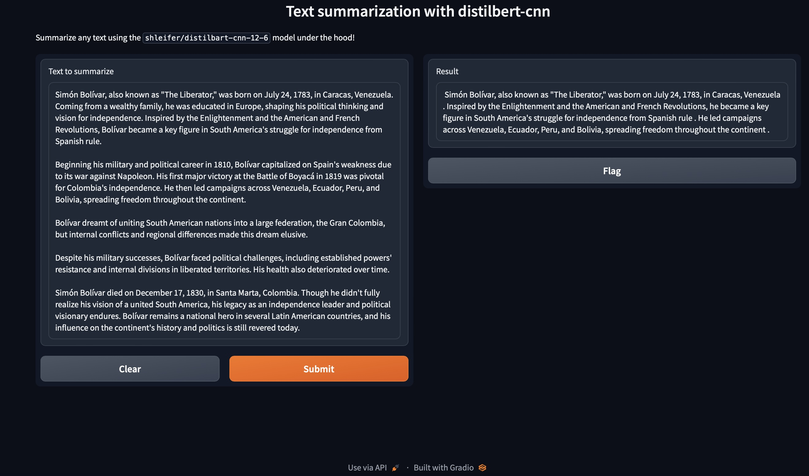
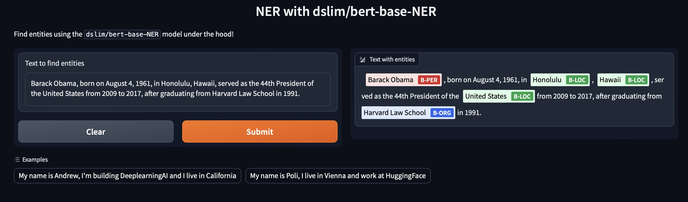

# Building Generative AI Applications with Gradio
This repo is based on the Deeplearning.ai short course: [Building Generative AI Applications with Gradio](https://learn.deeplearning.ai/huggingface-gradio/lesson/1/introduction?_gl=1*mzi8zq*_ga*MTUzNDg0Mzk5NC4xNzA0MTk3NjE3*_ga_PZF1GBS1R1*MTcwNjA2MDQ4MC4xNS4xLjE3MDYwNjA0ODUuNTUuMC4w)

## Creating and Activating the Conda Environment

To get started, you'll need to create a new Conda environment named `gradio` with Python 3.9.17. Use the following commands in your terminal:

```bash
conda create -n gradio python=3.9.17
conda activate gradio
pip install -r requirements.txt
```

# NLP Tasks with a simple Interface:

Notebook: [nlp_tasks_with_a_simple_interface](./notebooks/nlp_tasks_with_a_simple_interface.ipynb)

## Models Overview

### DistilBART-CNN for Text Summarization

- **Model**: Distilled version of BART Large CNN, specialized in summarization.
- **Background**: BART excels in text generation, and CNN indicates fine-tuning on news articles.
- **Distillation**: Smaller model mimicking a larger BART model for efficiency.
- **Advantages**: Efficient, fast, retains high performance in summarization.
- **Use Case**: Ideal for applications prioritizing speed and cost, without sacrificing quality.

### BERT-Based Model for Named Entity Recognition (NER)

- **Model**: Fine-tuned version of BERT for NER tasks.
- **Background**: BERT's bidirectional training offers a deep understanding of context.
- **Fine-Tuning**: Adapted to identify and classify entities like persons, locations, organizations.
- **Advantages**: State-of-the-art performance in entity recognition, adaptable for specific NER needs.
- **Use Case**: Suitable for tasks requiring accurate entity detection in various text formats.


## Summarization Interface
We'll build a simple interface for text summarization, allowing users to input a block of text and receive a concise summary.




## Entity Recognition
Finally, we'll create a feature for entity recognition in text, where users can input sentences and get identified entities like names, organizations, etc.




